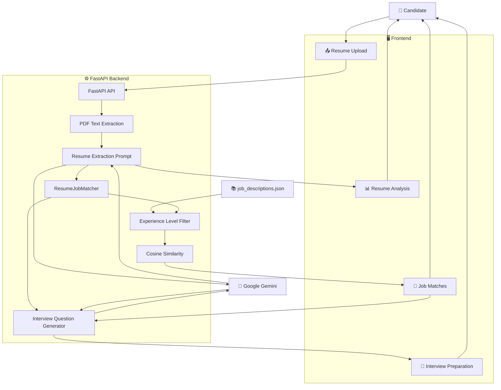
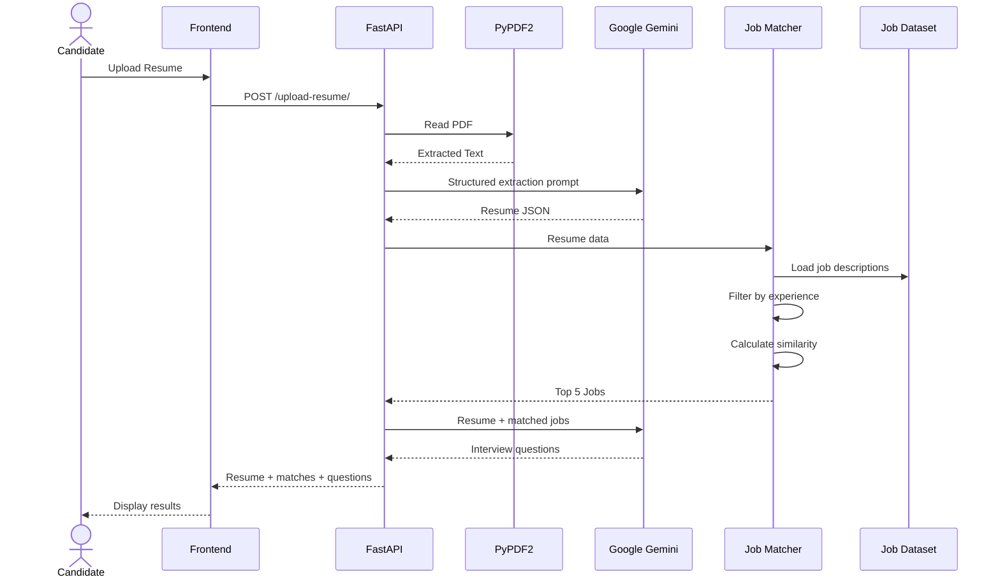
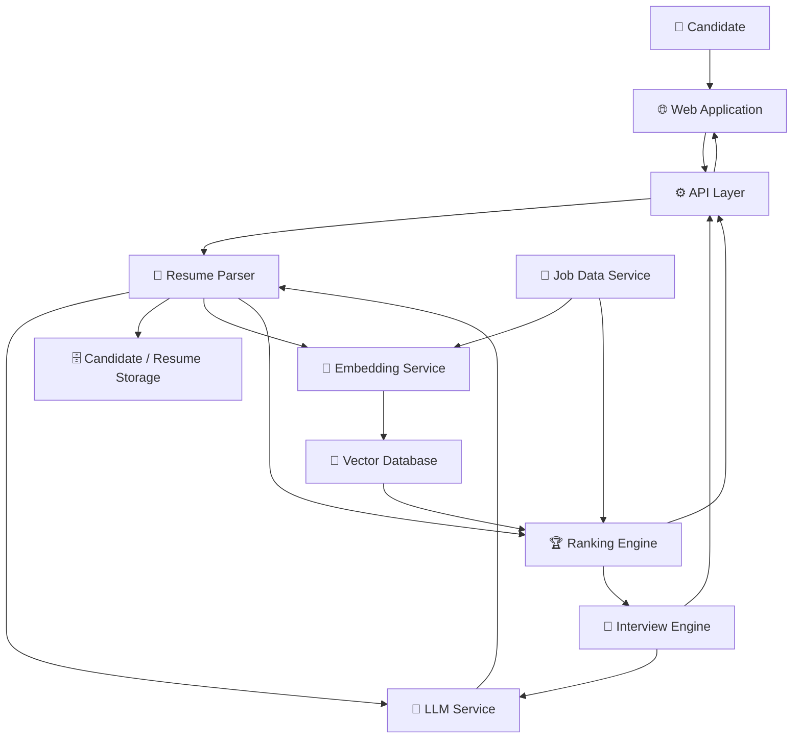

# 🧠 Intelligent Resume Analyzer & Job Matcher

> **An AI-powered career assistant that analyzes resumes, extracts structured candidate information, matches candidates with relevant job opportunities, and generates personalized interview questions.**

<p align="center">


</p>

---

## 🌟 Overview

**Intelligent Resume Analyzer & Job Matcher** is an AI-assisted recruitment and career-preparation application that transforms an unstructured resume into actionable career insights.

A candidate can upload a resume and the system performs a complete pipeline:

```text
📄 Resume PDF
      ↓
🔍 Text Extraction
      ↓
🤖 Gemini Resume Parsing
      ↓
🧾 Structured Candidate Profile
      ↓
🎯 Experience-Level Filtering
      ↓
📐 Similarity-Based Job Matching
      ↓
🏆 Top 5 Job Matches
      ↓
🎤 Personalized Interview Questions
```

The application combines **LLM-based information extraction**, **resume/job similarity scoring**, **rule-based experience filtering**, and **AI-generated interview preparation** into one workflow.

---

# 🎯 Problem Statement

Job seekers typically have to perform several disconnected tasks:

```text
Read Resume
    ↓
Identify Skills
    ↓
Search Jobs
    ↓
Compare Requirements
    ↓
Shortlist Jobs
    ↓
Prepare for Interviews
```

This application brings these steps together:

```text
                  ┌─────────────────────┐
                  │       RESUME        │
                  └──────────┬──────────┘
                             ↓
                    AI Resume Analysis
                             ↓
                 ┌───────────┴───────────┐
                 ↓                       ↓
          Resume Insights           Job Matching
                 │                       │
                 └───────────┬───────────┘
                             ↓
                  Interview Preparation
```

The objective is not merely to parse a resume, but to transform resume information into a **personalized job-search and interview-preparation workflow**.

---

# ✨ Key Features

## 📄 Intelligent Resume Parsing

The system extracts structured information from uploaded resume PDFs using Google Gemini.

Extracted information includes:

* Name
* Email
* Phone
* Skills
* LinkedIn
* Work experience
* Education
* Certifications
* Trainings
* Projects
* Awards
* Languages
* Publications
* Volunteer experience
* Total professional experience
* Experience level

The backend uses a schema-defined Gemini prompt and expects structured JSON output.

---

# 🧠 AI-Powered Resume Understanding

Gemini is instructed to transform raw resume text into a structured candidate profile.

```text
Raw Resume Text
       ↓
       Gemini
       ↓
Structured JSON
```

Example conceptual output:

```json
{
  "name": "Candidate Name",
  "email": "candidate@example.com",
  "skills": [
    "Python",
    "FastAPI",
    "Machine Learning"
  ],
  "work_experience": [
    {
      "job_title": "Software Engineer",
      "company": "Example Company",
      "responsibilities": [
        "Developed APIs",
        "Built ML pipelines"
      ]
    }
  ],
  "education": [
    {
      "degree": "B.Tech",
      "field_of_study": "Computer Science"
    }
  ]
}
```

---

# 📊 Experience Calculation

One of the more important pieces of resume intelligence is distinguishing **professional experience from internships**.

The Gemini extraction prompt explicitly instructs the model to:

* Exclude internships from professional experience
* Treat internship-only candidates as freshers
* Count full-time/part-time roles
* Handle `Present` or missing end dates
* Avoid double-counting overlapping employment
* Calculate total experience in months
* Convert months to years
* Classify candidates into `Fresher` or `Experienced`

The current thresholds are:

```text
< 1 year
   ↓
Fresher

≥ 1 year
   ↓
Experienced
```

This logic is part of the resume extraction prompt and is returned with the candidate profile.

---

# 🎯 Intelligent Job Matching

After the resume is structured, the system matches the candidate against an inbuilt job dataset stored in:

```text
job_descriptions.json
```

The matching process considers:

1. Candidate experience level
2. Resume content
3. Job description content
4. Semantic similarity
5. Ranking score

The application returns the **top 5 matches** sorted by similarity percentage.

---

# 🔎 Experience-Level Filtering

Before calculating similarity, the system filters jobs according to the candidate's experience level.

```text
Candidate
   │
   ├── Fresher
   │      ↓
   │   Fresher Jobs
   │
   └── Experienced
          ↓
      Experienced Jobs
```

This prevents a fresher from being ranked against jobs explicitly marked as experienced positions.

The backend compares the candidate's `experience_level` with each job's `Experience Level`.

---

# 📐 Similarity-Based Matching

The matching code uses **cosine similarity** from scikit-learn:

```python
cosine_similarity([vec1], [vec2])
```

The matching pipeline is:

```text
Resume
  ↓
Resume Text Representation
  ↓
Resume Vector
  ↓
                    ┌───────────────┐
Job Description ──→ │ Job Vector    │
                    └───────────────┘
                          ↓
                  Cosine Similarity
                          ↓
                    Match Score
```

Each job receives a:

```text
similarity_percentage
```

and jobs are sorted from highest to lowest score.

---

# ⚠️ Important Implementation Detail

The current repository's `ResumeJobMatcher` contains a placeholder-style deterministic vector generator rather than a live embedding-model API call.

Although the class is initialized with:

```text
text-embedding-3-small
```

the current `generate_embedding()` implementation creates a deterministic 384-dimensional vector from an MD5-derived seed and NumPy random values.

Conceptually:

```text
Text
 ↓
MD5 hash
 ↓
Deterministic seed
 ↓
384-dimensional NumPy vector
 ↓
Cosine similarity
```

This means the current similarity score is **not a true semantic embedding score**.

For production-quality semantic job matching, this component should be replaced with a real embedding model such as:

* Sentence Transformers
* OpenAI embeddings
* Gemini embeddings
* Another production embedding service

This is worth mentioning explicitly because it is an important technical distinction.

---

# 🏆 Matching Output

Each matched job contains fields such as:

```json
{
  "id": 1,
  "job_title": "Backend Developer",
  "company": "TechFusion Solutions",
  "location": "Bangalore, Karnataka, India",
  "job_type": "Hybrid",
  "requirements": [
    "Python",
    "MySQL",
    "Git"
  ],
  "experience_required": "fresher",
  "similarity_percentage": 87.45
}
```

The backend returns the top five jobs after sorting by similarity.

---

# 🎤 AI-Powered Interview Preparation

The system does more than recommend jobs.

It also generates **personalized interview questions** based on:

* Candidate resume
* Candidate experience
* Top job matches
* Job requirements

The interview-question generator uses Gemini and is implemented in:

```text
interview_questions.py
```

---

# 🧩 Interview Question Categories

The prompt asks Gemini to create:

### Resume-Based Questions

* Technical questions
* HR questions
* Soft-skill questions
* Scenario-based questions

### Job-Based Questions

For each top job match, questions are generated using:

```text
Job Role
Company
Job Requirements
Candidate Resume
```

The prompt requests **five job-based questions for each job match**.

---

# 🔄 Complete System Architecture



---

# 🔬 End-to-End Pipeline

```text
                         USER
                           │
                           ▼
                  ┌───────────────────┐
                  │ Upload Resume PDF │
                  └─────────┬─────────┘
                            │
                            ▼
                  ┌───────────────────┐
                  │ PyPDF2 Extraction │
                  └─────────┬─────────┘
                            │
                            ▼
                  ┌───────────────────┐
                  │ Resume Text       │
                  └─────────┬─────────┘
                            │
                            ▼
                  ┌───────────────────┐
                  │ Google Gemini     │
                  │ Resume Parsing    │
                  └─────────┬─────────┘
                            │
                            ▼
                  ┌───────────────────┐
                  │ Structured Resume │
                  │ JSON              │
                  └─────────┬─────────┘
                            │
              ┌─────────────┴──────────────┐
              ▼                            ▼
      ┌─────────────────┐         ┌──────────────────┐
      │ Experience      │         │ Resume           │
      │ Classification  │         │ Representation   │
      └────────┬────────┘         └────────┬─────────┘
               │                           │
               ▼                           ▼
       Experience Filter             Job Descriptions
                                           │
                                           ▼
                                  ┌──────────────────┐
                                  │ Similarity Score │
                                  └────────┬─────────┘
                                           │
                                           ▼
                                  ┌──────────────────┐
                                  │ Top 5 Jobs       │
                                  └────────┬─────────┘
                                           │
                                           ▼
                                  ┌──────────────────┐
                                  │ Gemini           │
                                  │ Interview Prep   │
                                  └────────┬─────────┘
                                           │
                                           ▼
                                  ┌──────────────────┐
                                  │ Personalized     │
                                  │ Questions        │
                                  └──────────────────┘
```

---

# 📄 Resume Processing Architecture



---

# 🧠 Gemini Resume Extraction

The resume parsing prompt defines a structured schema including:

```text
Personal Information
Skills
Work Experience
Education
Certifications
Trainings
Projects
Awards
Languages
Publications
Volunteer Experience
```

It also embeds explicit instructions for experience calculation and experience-level classification.

---

# 🗂️ Job Dataset

Job data is stored locally in:

```text
job_descriptions.json
```

The repository includes job descriptions across multiple categories, including roles such as:

* Backend Developer
* Software Developer
* Frontend Developer
* Full Stack Developer
* DevOps Engineer
* AI Specialist
* Data Scientist

and both **Fresher** and **Experienced** variants.

Each job record contains structured fields such as:

```text
id
Job Title
Company
Location
Job Type
About
Responsibilities
Requirements
Benefits
Experience Level
```

---

# 🖥️ Frontend Experience

The frontend is implemented as a lightweight single-page interface using:

* HTML
* Vanilla JavaScript
* Tailwind CSS

The application is divided into three major tabs:

```text
┌───────────────────────────────────────────┐
│ Upload Resume                             │
├───────────────────────────────────────────┤
│ Resume Analysis                           │
├───────────────────────────────────────────┤
│ Job Match & Interview Prep                │
└───────────────────────────────────────────┘
```

The current UI explicitly provides:

* Resume upload
* Resume analysis
* Skills display
* Experience summary
* Education display
* Recommended jobs
* Interview questions
* Resume-based questions
* Job-description-based questions

---

# 🎨 UI Workflow

```text
                  Resume Analyzer
                        │
        ┌───────────────┼─────────────────┐
        │               │                 │
        ▼               ▼                 ▼
     Upload          Analysis           Jobs
        │               │                 │
        │          Personal Info         │
        │          Skills                │
        │          Experience            │
        │          Education             │
        │                                 │
        │                              Top Jobs
        │                                 │
        └─────────────────────────────────┘
                                          │
                                          ▼
                                  Interview Questions
```

The interface uses a blue/purple visual theme with Tailwind utility classes and separate sections for the three workflow stages.

---

# 🔌 API Architecture

## `GET /`

Basic API health/welcome endpoint.

```json
{
  "message": "Welcome to the Resume Job Matcher API!"
}
```

---

## `POST /`

The backend also exposes a POST root endpoint returning the same welcome message.

---

# 📤 `POST /upload-resume/`

This is the main application endpoint.

### Input

Multipart file upload:

```text
file = resume.pdf
```

### Processing

```text
1. Validate PDF extension
2. Extract text
3. Validate extracted content
4. Build Gemini prompt
5. Extract structured resume JSON
6. Calculate experience level
7. Match jobs
8. Generate interview questions
9. Return JSON response
```

### Response Structure

```json
{
  "resume_data": {},
  "total_experience_years": 1.5,
  "experience_level": "Experienced",
  "match_results": [],
  "interview_questions": []
}
```

---

# 🎤 `POST /generate-questions/`

This endpoint allows interview questions to be generated for a selected job.

### Request

```json
{
  "resume_data": {
    "...": "..."
  },
  "job": {
    "...": "..."
  }
}
```

### Response

```json
{
  "questions": [
    "Question 1",
    "Question 2",
    "..."
  ]
}
```

The endpoint validates that both `resume_data` and `job` are provided before calling the interview-question generator.

---

# 🧪 Resume Validation

The backend currently accepts only files whose filename ends with:

```text
.pdf
```

and returns an error for other uploads.

It also rejects PDFs from which no text can be extracted.

> The frontend advertises PDF, DOCX, and DOC support in the upload UI, but the current backend only processes PDF files. This is an important implementation detail to fix before claiming multi-format support.

---

# 🧱 Project Structure

```text
Intelligent-Resume-Analyzer-Job-Matcher/
│
├── index.html
│
├── matching.py
│
├── interview_questions.py
│
├── job_descriptions.json
│
└── .gitignore
```

The repository is intentionally compact, with the FastAPI application, interview-generation logic, job dataset, and frontend contained at the project root.

---

# 📌 File Responsibilities

| File                     | Responsibility                                                                          |
| ------------------------ | --------------------------------------------------------------------------------------- |
| `index.html`             | Frontend UI, upload workflow, analysis display, job matches, interview preparation      |
| `matching.py`            | FastAPI application, PDF extraction, Gemini resume parsing, job matching, API endpoints |
| `interview_questions.py` | Gemini-based personalized interview-question generation                                 |
| `job_descriptions.json`  | Inbuilt job dataset used for matching                                                   |
| `.gitignore`             | Git ignore configuration                                                                |

---

# ⚙️ Technology Stack

| Layer                | Technology        | Purpose                              |
| -------------------- | ----------------- | ------------------------------------ |
| Language             | Python            | Backend                              |
| API                  | FastAPI           | REST endpoints                       |
| LLM                  | Google Gemini     | Resume parsing + interview questions |
| PDF Parsing          | PyPDF2            | Resume text extraction               |
| Similarity           | scikit-learn      | Cosine similarity                    |
| Numerical Processing | NumPy             | Vector representation                |
| Frontend             | HTML + JavaScript | User interface                       |
| Styling              | Tailwind CSS      | UI styling                           |
| Configuration        | python-dotenv     | Environment variables                |
| Data                 | JSON              | Job descriptions                     |

These technologies correspond to the actual dependencies/imports and repository implementation.

---

# 🚀 Installation

## Prerequisites

Install:

* Python 3.10+
* pip
* Git
* Google Gemini API key

---

# 1️⃣ Clone the Repository

```bash
git clone https://github.com/patilsharvari184/Intelligent-Resume-Analyzer-Job-Matcher.git

cd Intelligent-Resume-Analyzer-Job-Matcher
```

---

# 2️⃣ Create Virtual Environment

### Windows

```bash
python -m venv venv
venv\Scripts\activate
```

### Linux / macOS

```bash
python3 -m venv venv
source venv/bin/activate
```

---

# 3️⃣ Install Dependencies

```bash
pip install fastapi
pip install uvicorn
pip install python-dotenv
pip install PyPDF2
pip install numpy
pip install scikit-learn
pip install google-generativeai
pip install python-multipart
```

---

# 4️⃣ Configure Gemini

Create a `.env` file in the project directory:

```env
GEMINI_API_KEY=your_gemini_api_key
```

The application loads the API key with `python-dotenv` and configures the Gemini SDK.

---

# 5️⃣ Start the Backend

```bash
uvicorn matching:app --reload
```

Default development address:

```text
http://127.0.0.1:8000
```

FastAPI documentation:

```text
http://127.0.0.1:8000/docs
```

---

# 6️⃣ Open the Frontend

Open:

```text
index.html
```

in your browser.

The current frontend sends API requests to:

```text
http://127.0.0.1:8000
```

For more reliable browser behavior, serve the project through a local HTTP server rather than opening the HTML file directly.

Example:

```bash
python -m http.server 5500
```

Then open:

```text
http://127.0.0.1:5500
```

---

# 🔄 Local Development Architecture

```text
                         LOCAL MACHINE
────────────────────────────────────────────────────

          Browser
             │
             ▼
        index.html
             │
             │ HTTP
             ▼
      ┌─────────────────┐
      │ FastAPI :8000   │
      │                 │
      │ /upload-resume/ │
      │ /generate-      │
      │ questions/      │
      └────────┬────────┘
               │
        ┌──────┴──────────┐
        │                 │
        ▼                 ▼
  PyPDF2 / Matcher     Gemini API
        │                 │
        ▼                 │
 job_descriptions.json   │
        └────────┬────────┘
                 ▼
          Final Response
                 │
                 ▼
              Browser
```

---

# 🧪 Example User Journey

### Step 1 — Upload

Candidate uploads:

```text
resume.pdf
```

### Step 2 — Analyze

The system extracts:

```text
Name
Skills
Experience
Education
Projects
Certifications
```

### Step 3 — Classify Experience

```text
0.7 years
     ↓
Fresher
```

or:

```text
2.4 years
     ↓
Experienced
```

### Step 4 — Match Jobs

Candidate receives:

```text
#1 Backend Developer       89.4%
#2 Software Developer      86.7%
#3 Full Stack Developer    82.5%
#4 AI Specialist           80.9%
#5 Data Scientist          78.6%
```

### Step 5 — Interview Preparation

Select a job and receive questions based on:

```text
Resume
+
Job Description
+
Candidate Experience
```

---

# 🎯 Example Matching Scenario

Suppose a resume contains:

```text
Python
FastAPI
MySQL
REST APIs
Machine Learning
```

and the candidate is classified as:

```text
Fresher
```

The system filters the job dataset to fresher roles and calculates a similarity score for each remaining job.

```text
Resume
  ↓
Candidate Profile
  ↓
Experience = Fresher
  ↓
Filter Fresher Jobs
  ↓
Build Resume Representation
  ↓
Build Job Representations
  ↓
Cosine Similarity
  ↓
Sort
  ↓
Top 5
```

This makes the recommendation process more targeted than comparing the resume against every available job indiscriminately.

---

# 🎤 Example Interview-Preparation Workflow

```text
Candidate Resume
       +
Top Job Matches
       │
       ▼
    Gemini
       │
       ├── Resume-based technical questions
       ├── HR questions
       ├── Soft-skill questions
       ├── Scenario-based questions
       │
       └── Job-based questions
               │
               ├── Role-specific
               ├── Company-specific
               └── Requirement-specific
```

The interview-question prompt explicitly asks Gemini to tailor questions to both the candidate and the matched roles.

---

# 🔐 Security Considerations

The current prototype uses environment variables for the Gemini API key, which is better than hard-coding the secret directly into the application.

For production, additional safeguards should be added:

* File-size limits
* Strict MIME-type validation
* Authentication
* Rate limiting
* CORS restriction
* Secure API configuration
* PII handling policies
* Resume data retention controls
* Structured LLM output validation
* Prompt-injection protection

---

# ⚠️ Current Limitations

The following limitations are present in the current implementation.

## 1. PDF Backend Support

Although the UI advertises:

```text
PDF
DOCX
DOC
```

the backend currently accepts only filenames ending in `.pdf`.

---

## 2. Similarity Engine

The current vector generator is deterministic/randomized rather than a true semantic embedding model.

Therefore:

> **The current similarity score should be treated as a prototype matching score, not a production-grade semantic relevance score.**

---

## 3. Local Job Dataset

Job descriptions are loaded from:

```text
job_descriptions.json
```

This means recommendations are constrained to the supplied local dataset rather than a live job marketplace.

---

## 4. No Persistent User Accounts

The current repository does not implement user authentication or persistent candidate profiles.

---

## 5. LLM Dependency

Resume extraction and interview generation depend on the Gemini API.

API quota, availability, latency, or model behavior can therefore affect the workflow.

---

# 🔮 Future Enhancements

## 🧠 Better Semantic Matching

Replace the current deterministic vector generator with actual embeddings:

```text
Resume
  ↓
Sentence Transformer / Gemini / OpenAI Embeddings
  ↓
Vector
  ↓
Job Embeddings
  ↓
Cosine Similarity
  ↓
Semantic Match
```

---

## 🔍 Hybrid Matching

Combine semantic similarity with explicit skill matching.

```text
Final Score =
    Semantic Similarity
    +
    Skill Overlap
    +
    Experience Fit
    +
    Location Fit
    +
    Job-Type Fit
```

This would produce a much more interpretable matching system.

---

## 💼 Live Job Search

Connect to live job sources or APIs:

```text
Resume
   ↓
Candidate Profile
   ↓
Job APIs
   ↓
Live Job Data
   ↓
Ranking
   ↓
Recommendations
```

---

## 📊 Match Explanation

Instead of only showing:

```text
Match: 87%
```

show:

```text
87% Match

✓ Python
✓ FastAPI
✓ MySQL
✓ REST API
✓ Backend Experience

Missing:
△ Docker
△ AWS
```

This gives users actionable feedback.

---

## 🧑‍💼 Resume Improvement

Add an AI resume coach that identifies:

* Missing skills
* Weak bullet points
* Missing measurable achievements
* ATS keyword gaps
* Formatting issues
* Role-specific improvements

---

## 🎯 ATS Optimization

A future module could compare:

```text
Resume
+
Job Description
       ↓
ATS Compatibility Score
       ↓
Missing Keywords
       ↓
Recommended Changes
```

---

## 🎤 Interview Simulator

Extend the current question generator into an interactive interviewer:

```text
Job Selection
      ↓
AI Interviewer
      ↓
Question
      ↓
Candidate Answer
      ↓
AI Evaluation
      ↓
Score + Feedback
      ↓
Next Question
```

---

## 📈 Career Dashboard

A future dashboard could show:

```text
Resume Strength
───────────────
████████░░ 82%

Top Skill Gaps
──────────────
AWS
Docker
System Design

Best Job Categories
───────────────────
AI Engineer
Backend Developer
ML Engineer
```

---

# 🏗️ Production-Ready Architecture

A scalable version could evolve into:



---

# 📈 Evaluation Strategy

A mature version should evaluate the system at three levels.

## Resume Extraction

Measure:

```text
Field Accuracy
JSON Validity
Missing Field Rate
Date Extraction Accuracy
Experience Calculation Accuracy
```

---

## Job Matching

Measure:

```text
Precision@K
Recall@K
NDCG
Skill Match Accuracy
Experience-Level Accuracy
```

---

## Interview Question Quality

Evaluate:

```text
Resume Relevance
Job Relevance
Technical Relevance
Specificity
Difficulty
Duplication
```

---

# 🧠 Engineering Highlights

This project demonstrates several practical AI engineering concepts.

### Generative AI

```text
Gemini
 ├── Resume information extraction
 └── Interview question generation
```

### NLP

```text
Unstructured Resume
       ↓
Structured Candidate Profile
```

### Machine Learning

```text
Resume Vector
      +
Job Vector
      ↓
Cosine Similarity
```

### Information Retrieval

```text
Candidate Profile
      ↓
Filter
      ↓
Rank
      ↓
Top 5
```

### API Engineering

```text
FastAPI
 ├── /upload-resume/
 └── /generate-questions/
```

---

# 💼 Business Value

The project brings several recruitment activities into a single workflow.

### For Candidates

* Understand their resume
* Discover relevant roles
* Identify potential career directions
* Prepare for specific interviews
* Reduce manual job-search effort

### For Recruiters / Career Platforms

The same architecture can be extended to:

* Candidate screening
* Job recommendation
* Skill-gap analysis
* Interview preparation
* Candidate ranking
* Career guidance

---

# 🏆 Why This Project Stands Out

This project goes beyond a simple resume parser.

It combines:

```text
📄 Resume Parsing
        +
🧠 Generative AI
        +
🎯 Experience Classification
        +
📐 Similarity Matching
        +
💼 Job Recommendation
        +
🎤 Interview Generation
```

into a single end-to-end workflow.

The strongest architectural idea is the progression:

```text
Resume
  ↓
Understand Candidate
  ↓
Find Relevant Opportunities
  ↓
Prepare Candidate
```

---

# 📊 Technology Summary

| Category       | Technology        |
| -------------- | ----------------- |
| Backend        | Python            |
| API            | FastAPI           |
| LLM            | Google Gemini     |
| PDF Processing | PyPDF2            |
| Similarity     | Cosine Similarity |
| ML Utilities   | NumPy             |
| ML Library     | scikit-learn      |
| Frontend       | HTML              |
| Frontend Logic | JavaScript        |
| Styling        | Tailwind CSS      |
| Configuration  | python-dotenv     |
| Job Data       | JSON              |

---

# 👩‍💻 Author

## Sharvari Patil

**AI/ML Engineer | Python Developer | Generative AI Enthusiast**

Interested in building practical AI systems involving:

**Generative AI · NLP · Machine Learning · LLMs · Python · FastAPI · AI Automation**

---

# 📝 Resume-Ready Project Description

### ATS-Friendly Version

> **Intelligent Resume Analyzer & Job Matcher** — Developed an AI-powered career assistant using **Python, FastAPI, Google Gemini, PyPDF2, NumPy, scikit-learn, JavaScript, and Tailwind CSS**. Implemented LLM-based resume parsing, structured candidate-profile extraction, internship-aware experience classification, experience-level job filtering, cosine-similarity-based job ranking, and personalized interview-question generation using resume and job requirements.

### Technical Version

> Built an end-to-end resume intelligence platform that extracts structured candidate data from PDF resumes using **Gemini**, calculates professional experience while excluding internships, filters jobs by experience level, ranks candidate-job pairs using cosine similarity, and generates tailored resume-based and job-specific interview questions. Developed FastAPI endpoints for resume analysis and dynamic interview-question generation and integrated a Tailwind/JavaScript frontend for interactive results.

---

# 🎤 Interview Answer

### "Explain this project."

> **I developed an AI-powered Resume Analyzer and Job Matcher that takes a candidate's PDF resume and converts it into a structured profile using Google Gemini. The model extracts details such as skills, experience, education, projects, and certifications. I also added logic to distinguish internships from professional experience and classify candidates as freshers or experienced.**
>
> **The structured profile is then matched against an inbuilt job dataset. The system first filters jobs by experience level and then calculates a similarity score between the resume representation and each job description using cosine similarity. The top five jobs are returned to the user.**
>
> **The project also includes an interview-preparation module. Gemini receives the candidate's resume and top job matches and generates tailored technical, HR, soft-skill, scenario-based, and job-specific interview questions. The backend is built with FastAPI and the frontend uses HTML, JavaScript, and Tailwind CSS.**
>
> **One area I would improve for production is the current matching layer: the repository uses a deterministic vector-generation placeholder, so I would replace that with a real embedding model and add hybrid skill-based ranking for more meaningful semantic matching.**

---

# 🚀 End-to-End Summary

```text
                   📄 RESUME
                       │
                       ▼
              ┌─────────────────┐
              │   PyPDF2        │
              │ Text Extraction │
              └────────┬────────┘
                       │
                       ▼
              ┌─────────────────┐
              │ Google Gemini   │
              │ Resume Parsing  │
              └────────┬────────┘
                       │
                       ▼
              ┌─────────────────┐
              │ Candidate JSON  │
              └────────┬────────┘
                       │
          ┌────────────┴────────────┐
          │                         │
          ▼                         ▼
   Experience Level           Resume Representation
          │                         │
          ▼                         ▼
   Filter Jobs              Compare with Jobs
                                    │
                                    ▼
                           Cosine Similarity
                                    │
                                    ▼
                              🏆 Top 5 Jobs
                                    │
                                    ▼
                              Google Gemini
                                    │
                                    ▼
                         🎤 Interview Questions
```

---

# ⭐ Final Takeaway

> **Intelligent Resume Analyzer & Job Matcher turns a static resume into an interactive career profile by combining LLM-powered information extraction, experience-aware job filtering, similarity-based ranking, and personalized interview preparation.**

```text
UPLOAD
  ↓
ANALYZE
  ↓
MATCH
  ↓
RANK
  ↓
PREPARE
  ↓
GET INTERVIEW-READY 🚀
```

---

## 🔗 Repository

**GitHub:**
https://github.com/patilsharvari184/Intelligent-Resume-Analyzer-Job-Matcher

## 🔗 Live Demo ▶️

**YouTube:**
https://youtu.be/8V-asbVamK4
